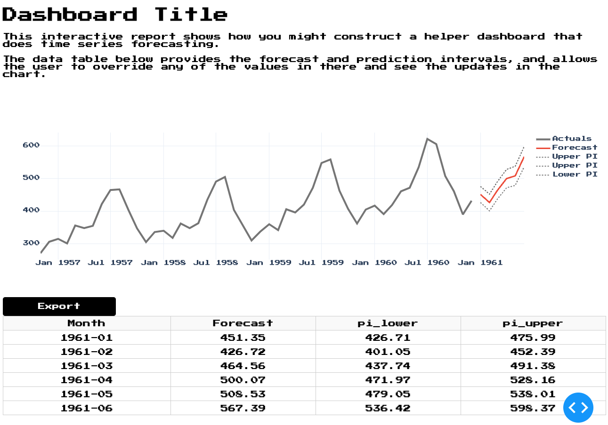

# time-series-dashboard
A simple 1-page dashboard example using Dash & Python to create a user forecasting interface

## Key Features

* [x] Line plot that plots historical data, forecast, and upper/lower prediction intervals
* [x] Editable Datatable with the time series forecast that can be overridden
* [ ] Abilty to upload own dataset (1000 row limit) as CSV and use that for historicals
* [x] Ability to download forecast as CSV
* [ ] Add styling and modularize

## How to install

Navigate to the directory and use pip install from the `requirements.txt` file.

```bash
pip install -r requirements.txt
```

## How to run

```bash
python dashboard.py
```

## Screenshot



## Deployment

* [x] added Procfile to use gunicorn and added `server=app.server` in `dashboard.py`
  * [x] Procfile fixed to say `gunicorn dashboard:server` to point correctly to `dashboard.py` and the `server` variable
* [x] added runtime.txt to pick the right Python buildpack on Heroku
* [x] example up on Herokup at: https://dash-timeseries-card.herokuapp.com